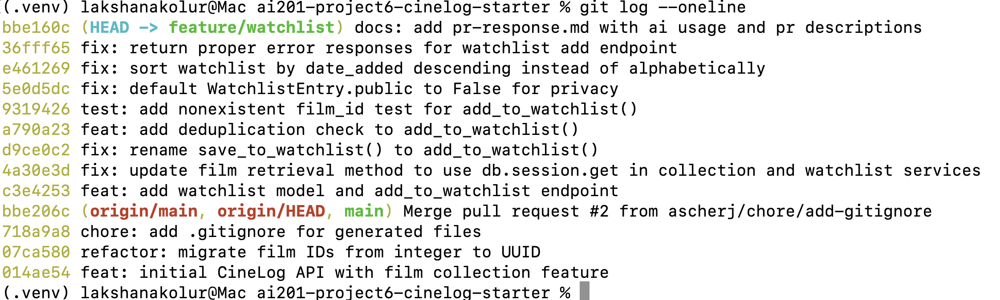

# PR Response Doc — CineLog Watchlist Feature

## AI Usage
I used Claude throughout this project for several things: orienting in the codebase before making changes (asking it to walk through `add_to_collection()` and the `test_collection.py` test pattern before writing the watchlist equivalents), resolving git conflicts during the rebase (it identified the UUID type mismatch in `models.py` and helped me update `WatchlistEntry.film_id` accordingly), and verifying commit messages against `CONTRIBUTING.md`'s conventions before committing.

For Comment 4, I drafted my own position first (private default, for privacy reasons) and then explicitly asked it to stress-test the argument: "What counterargument would a careful code reviewer raise against this position? What tradeoff am I not acknowledging?" It found something I'd missed by actually checking the code — `get_watchlist()` doesn't filter on the `public` field at all, and there's no auth check on the read endpoint, so the default I was debating currently has zero real effect on privacy. I incorporated that finding directly into a "Known gaps" section, since it was a concrete, code-verified point I hadn't caught myself.

For Comment 5, I drafted my own core position first (agree with the maintainer on date-added order, with a caveat that old entries could go stale) and asked it to help me write it up. It kept my original argument and caveat intact, and added the consistency point with `get_collection()`'s existing sort order and a counterpoint about alphabetical sorting still mattering for long-list scanning — both of which I agreed with and kept, but the core position and the staleness concern were mine before I asked.

## Comment 1 — Rename
**What I did:**
Renamed save_to_watchlist() to add_to_watchlist() in services/watchlist_service.py to match the codebase's verb_to_noun convention (e.g. add_to_collection()). Used VS Code's Rename Symbol (F2) on the function definition, which updated both the definition and the single call site in routes/watchlist/watchlist.py (import and function call) in one operation. Committed separately as fix: rename save_to_watchlist() to add_to_watchlist(), since it's a pure rename with no behavior change.

**How I verified:** Ran Find All References (Shift+F12) before and after the rename to confirm the reference count matched. Also ran a project-wide search for save_to_watchlist to confirm no leftover references remained anywhere (code, imports, comments), and confirmed add_to_watchlist now appears in all three expected spots: the definition, the import, and the call site.

## Comment 2 — Deduplication
**What I did:** Added a deduplication check to add_to_watchlist() in services/watchlist_service.py, following the same pattern as add_to_collection() in services/collection_service.py. Before creating a new WatchlistEntry, the function now queries for an existing entry with the same user_id and film_id; if one exists, it raises a new AlreadyInWatchlistError instead of creating a duplicate. Also added a matching DB-level UniqueConstraint("user_id", "film_id") on WatchlistEntry in models.py, mirroring the constraint already on CollectionEntry, so the app-level check isn't the only thing preventing duplicates under a race condition. Committed separately as feat: add deduplication check to add_to_watchlist().

**How I verified:** Compared the new logic side-by-side with add_to_collection() to confirm the same order of checks (film exists → duplicate check → create) and the same error-raising style (raise, don't return a sentinel). Confirmed AlreadyInWatchlistError is scoped to the watchlist domain rather than reusing AlreadyInCollectionError, since the two features track different things. Ran pytest tests/ -v after 3 code changes to make sure that nothing has broken.

## Comment 3 — Missing test
**What I did:** Created tests/test_watchlist.py and added test_add_to_watchlist_nonexistent_film_raises(), mirroring test_add_to_collection_nonexistent_film_raises() from test_collection.py. It reuses the same fixture structure (app, sample_user, sample_film, in-memory SQLite) and asserts that calling add_to_watchlist() with a fake film_id raises FilmNotFoundError, imported from services.watchlist_service (which re-exports it from services.collection_service). Committed separately as test: add nonexistent film_id test for add_to_watchlist().

**How I verified:** Ran `pytest tests/test_watchlist.py -v` and confirmed the test passes:

```
(.venv) lakshanakolur@Mac ai201-project6-cinelog-starter % pytest tests/test_watchlist.py -v
======================================================= test session starts ========================================================
platform darwin -- Python 3.14.5, pytest-9.1.1, pluggy-1.6.0 -- /Users/lakshanakolur/Desktop/CodePath AI course 2026/ai201-project6-cinelog-starter/.venv/bin/python3.14
cachedir: .pytest_cache
rootdir: /Users/lakshanakolur/Desktop/CodePath AI course 2026/ai201-project6-cinelog-starter
collected 1 item

tests/test_watchlist.py::test_add_to_watchlist_nonexistent_film_raises PASSED                                                [100%]

======================================================== 1 passed in 0.23s =========================================================
```

## Comment 4 — Default visibility
**My position:** `WatchlistEntry.public` should default to `False` (private), not `True`.

**Reasoning:** A watchlist reveals intent, not accomplishment — it's a list of films someone hasn't watched yet, which can say as much about their current mood, taste, or interests as a diary entry would. I'm optimizing for the user who adds films casually without thinking about who can see them: defaulting to private means their list stays theirs until they explicitly decide to share it, rather than being exposed by default and only noticed after the fact. That matches the general privacy-by-default principle — data isn't shared until the user takes an affirmative action to share it, not the other way around.

**Tradeoff acknowledged:** Defaulting to public would make the feature more useful for discovery out of the box — friends could browse each other's watchlists without anyone needing to opt in, and "add to watchlist" would double as a lightweight, ambient recommendation signal across the app. Defaulting to private gives up that immediacy: the social/discovery value only kicks in once a user manually flips their list to public, and most users won't bother, which blunts a feature that could otherwise drive engagement. I think that's an acceptable cost for not exposing personal data without consent, but it is a real cost.

**Known gaps / anticipated pushback:** Whichever default we pick, it's currently disconnected from actual behavior. `get_watchlist()` doesn't filter on `entry.public` at all, and `GET /watchlist/<user_id>` has no ownership or auth check — it returns any user's full watchlist to any caller regardless of this flag. So today, the default has no real effect on who can see the data; the enforcement needs to be wired into the read path before this field protects anything. There's also no endpoint to update `public` after an entry is created, so whatever default ships is effectively permanent per entry — the "friction" I described above understates this, since there's no toggle yet to be frictional about. I'd also flag that some watch-tracking apps (Letterboxd, Trakt) default this kind of data to visible-by-default as part of a public profile, so users coming from that mental model may find a private default surprising rather than just less discoverable. I'm still landing on private as the right default, but the enforcement gap and missing update path should be called out as follow-up work, not silently left unresolved.

## Comment 5 — Sort order
**My position:** I agree with the maintainer — `get_watchlist()` should sort by `date_added` descending (most recent first), not alphabetically by title. I've updated the `order_by` clause in `services/watchlist_service.py` to match.

**Reasoning:** A watchlist is a working queue, not a reference list — the behavior it's optimizing for is "what did I just decide I want to watch," which is inherently recency-driven. When someone adds three films after a conversation with a friend, they're likely to open the watchlist again shortly after and expect those to be right at the top, not sorted wherever their titles happen to fall alphabetically. This also brings the watchlist in line with `get_collection()`, which already sorts by `date_added.desc()` — having the two most-related features in the app behave inconsistently (one by recency, one alphabetically) would be a harder thing to justify than the sort order itself.

**Engagement with reviewer's point:** The maintainer's core claim is "most users want to see what they added recently," and I think that's right for the common case — a watchlist is usually short and actively managed, so recency is a good proxy for relevance. Where I'd push back slightly, if I were arguing the other side: alphabetical sorting is more useful once a list gets long and a user is scanning for one specific title rather than reviewing what's new — closer to browsing a shelf than checking a queue. But that's a search problem, not a default-ordering problem, and it's better solved later with actual search/filter on top of a sensible default than by picking a worse default now to compensate for a feature that doesn't exist yet.

The real cost I'd flag, and the one I raised in my own draft before the maintainer's comment: date-added ordering means anything added early and not watched sinks to the bottom and effectively goes stale — the exact opposite of what you'd want if the whole point of a watchlist is to eventually surface the older, forgotten entries so someone actually watches them. I don't think that's a reason to reject date-added as the default, since "surface stale entries" is a discovery/reminder feature that doesn't exist yet either way — but it's worth naming as a follow-up worth designing for, rather than assuming date-added ordering alone solves the watchlist's whole job.

## Comment 6 — Rebase
**What conflicted:** Ran `git fetch origin` then `git rebase origin/main`. Before the rebase could even start, two untracked local files blocked it: an untracked `.gitignore` that would've been overwritten by checkout (resolved by deleting my copy, since `main`'s version was a strict superset of mine), and unstaged changes in `models.py` and `services/watchlist_service.py` from Comments 4 and 5 that hadn't been committed yet (resolved by committing them separately, per the one-logical-change-per-commit convention).

Once the rebase actually started, `models.py` conflicted while replaying `feat: add deduplication check to add_to_watchlist()`. `main` had migrated `Film.id` (and `CollectionEntry.film_id`) from `db.Integer` to `db.String(36)` (UUID) in a `refactor: migrate film IDs from integer to UUID` commit that landed on `main` after my branch point. My branch's `WatchlistEntry.film_id` was still declared as `db.Column(db.Integer, ...)`, so Git couldn't reconcile the two versions of the file automatically.

**How I resolved it:** Kept my branch's `WatchlistEntry` class (with the `UniqueConstraint` from Comment 2) but changed `film_id` from `db.Integer` to `db.String(36)` to match `Film.id` and `CollectionEntry.film_id`. I deliberately left `public=True` unchanged at this point in the resolution, since the commit being replayed here predates the Comment 4 fix (`fix: default WatchlistEntry.public to False`) later in the same rebase — flipping it early would've fought with that commit's own diff instead of letting it apply cleanly on top. While in there, I also updated two docstrings that still described `film_id` as an integer even though they weren't flagged as conflicts: the `Args` section in `add_to_watchlist()` (`services/watchlist_service.py`) and the request-body comment in `routes/watchlist/watchlist.py`, both now describe `film_id` as a UUID string. Staged the resolved files and ran `git rebase --continue` for each remaining commit; the rest applied cleanly with no further conflicts.

**How I verified no conflict remains:** Confirmed the working tree had no leftover `<<<<<<<`/`=======`/`>>>>>>>` markers in `models.py` before staging. After the rebase finished, ran `git log --oneline --graph` to check the branch's own 7 commits are single-parent and linear — the only merge commit in the log (`bbe206c`, merging a `.gitignore` PR) predates my branch point on `main` and isn't one my branch introduced, so it doesn't violate the "no merge commits" requirement. Finally, since the rebase rewrote commit hashes, `git status` showed my branch and `origin/feature/watchlist` had diverged (10 and 5 commits respectively) — force-pushed with `git push --force-with-lease origin feature/watchlist` to update the remote to the new linear history.

## PR Description



### What this feature does
Adds a Watchlist to CineLog — a place for users to save films they intend to watch later, separate from their Collection (films already watched). Two endpoints back it: `GET /watchlist/<user_id>` returns a user's watchlist, and `POST /watchlist/<user_id>/add` adds a film to it, rejecting films that don't exist (404) or are already on the list (409).

### Design decisions
- **Visibility default:** `WatchlistEntry.public` defaults to `False` (private), not `True`. A watchlist reveals intent and taste before a user has chosen to share it, so I optimized for privacy-by-default — a user's list stays private until they take an explicit action to share it, rather than being exposed by default. The tradeoff: a public default would make the feature more discoverable out of the box (friends browsing each other's watchlists without either side opting in); defaulting to private gives that up, and most users won't bother flipping the setting once it exists. I also flagged that the `public` flag isn't enforced anywhere yet (the read endpoint has no auth/ownership check and doesn't filter on it), so this default is the intended posture for when that enforcement is added, not something that changes behavior today.
- **Sort order:** `get_watchlist()` sorts by `date_added` descending (most recent first) instead of alphabetically by title. A watchlist behaves like a queue of recent intent rather than a reference list, so recency is a better default than alphabetical — this also brings it in line with `get_collection()`, which already sorts the same way. Tradeoff: alphabetical is more useful once a list gets long and someone is scanning for one specific title rather than reviewing what's new; and date-added ordering means old, unwatched entries sink to the bottom and can go stale. I think both are acceptable costs for now, and better solved later with search/filtering than by picking a worse default today.

### How to test manually
There's no API for creating users or films (`routes/films.py` is read-only, and there's no user-creation endpoint), so seed one of each first via a Python shell:

```python
from app import create_app, db
from models import User, Film

app = create_app()
with app.app_context():
    user = User(username="testuser", email="test@example.com")
    film_a = Film(title="Paddington 2", year=2017, genre="Comedy")
    film_b = Film(title="Alien", year=1979, genre="Horror")
    db.session.add_all([user, film_a, film_b])
    db.session.commit()
    print("user_id:", user.id)
    print("film_a_id:", film_a.id)
    print("film_b_id:", film_b.id)
```

Then, with the app running (`python app.py`, `http://localhost:5000`), using the printed IDs:

1. `GET /watchlist/<user_id>` → expect `[]` (empty watchlist).
2. `POST /watchlist/<user_id>/add` with `{"film_id": "<film_a_id>"}` → expect `201`, entry JSON with `"public": false`.
3. Wait a second, then `POST /watchlist/<user_id>/add` with `{"film_id": "<film_b_id>"}` → expect `201`.
4. `GET /watchlist/<user_id>` → expect film B listed before film A (newest-added first), confirming the sort-order decision.
5. Repeat step 2 (same `film_a_id` again) → expect `409` with an "already in this user's watchlist" error, confirming deduplication.
6. `POST /watchlist/<user_id>/add` with a random/fake UUID as `film_id` → expect `404` with a "no film found" error.